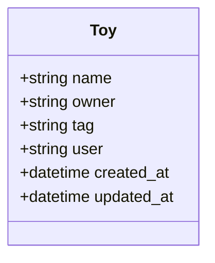

# 🧸 kxdToys

A Ruby on Rails app for managing your toy collection! 🛠️🧸 Easily create, read, update, and delete toy records, with support for HTML, XML, and JSON formats. 🚀

## ✨ Features

- 📝 Full CRUD for toys
- ✅ Data validation
- 🌐 RESTful API (HTML, XML, JSON)
- 🎨 Clean, user-friendly interface

## 🛠️ Requirements

- 💎 Ruby 3.2.2+
- 🚂 Rails 7.1.x
- 🗄️ SQLite3
- 📦 Bundler

## 🚦 Getting Started

1. ⬇️ Clone the repo
2. 📦 `bundle install`
3. 🗄️ `bin/rails db:migrate`
4. ▶️ Start the server:
    - `./start.sh` (recommended)
    - or `bin/rails server`
5. 🌍 Visit [http://localhost:3000](http://localhost:3000)

### 🏁 About the Start Script

The `start.sh` script:
- 📦 Installs dependencies
- 🗄️ Runs migrations
- ▶️ Starts the server

Just run:
```bash
./start.sh
```


## 🗃️ Database Structure

Toys have:
- 🏷️ **name** (required)
- 👤 **owner** (required)
- 🏷️ **tag** (required)
- 👥 **user** (optional)



## 🔌 API Usage

Simple endpoints for toy management:

- 📄 `GET /toys.json` – List all toys
- 🔍 `GET /toys/1.json` – Get a toy
- ➕ `POST /toys.json` – Create a toy
- ✏️ `PUT /toys/1.json` – Update a toy
- ❌ `DELETE /toys/1.json` – Delete a toy

Use `.xml` for XML responses!

## 🧑‍💻 Development

Standard Rails 7 structure:
- 📦 Models: `app/models`
- 🕹️ Controllers: `app/controllers`
- 🖼️ Views: `app/views`
- 🗄️ Migrations: `db/migrate`
- ⚡ JavaScript: `app/javascript`
- 🎨 Styles: `app/assets/stylesheets`

## ⬆️ Upgrade Notes

Upgraded from Rails 3.0.8 → 7.1.x (April 2025):
- 🧹 Modernized code
- 🗂️ Asset pipeline update
- 🔐 Credentials system
- 🐾 Puma web server

## 📄 License

Licensed under the MIT License – see [LICENSE](LICENSE) for details.

## 📬 Contact

For questions or issues, open an issue in the repo!
