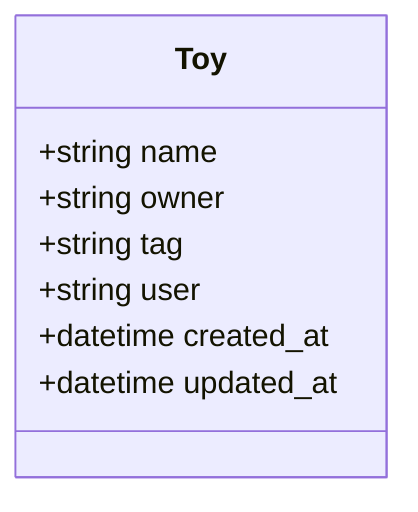

# kxdToys

A Ruby on Rails application for managing toy information in a collection. This application allows users to create, read, update, and delete toy records, with support for multiple output formats including HTML, XML, and JSON.

## Features

- Full CRUD operations for toy management
- Data validation for toy records
- RESTful API with multiple response formats (HTML, XML, JSON)
- Clean, user-friendly interface

## Requirements

- Ruby 3.2.2 or newer
- Rails 7.1.x
- SQLite3 1.6.x
- Bundler

## Getting Started

1. Clone the repository
2. Run `bundle install` to install dependencies
3. Run `bin/rails db:migrate` to set up the database
4. Start the server using one of these methods:
   - Run the included start script: `./start.sh`
   - Or manually start the server: `bin/rails server`
5. Visit `http://localhost:3000` in your browser

### About the Start Script

The repository includes a convenient `start.sh` script that:
- Installs all dependencies with `bundle install`
- Runs any pending database migrations with `bin/rails db:migrate`
- Starts the Rails server

To use it, simply run:
```bash
./start.sh
```

## Database Structure

The application stores toy information with the following attributes:

- **name**: The name of the toy (required)
- **owner**: The owner of the toy (required)
- **tag**: A tag or category for the toy (required)
- **user**: Additional user information (optional)



## API Usage

The application provides a simple API for toy management:

- GET `/toys.json` - List all toys in JSON format
- GET `/toys/1.json` - Get a specific toy in JSON format
- POST `/toys.json` - Create a new toy
- PUT `/toys/1.json` - Update an existing toy
- DELETE `/toys/1.json` - Delete a toy

Similar endpoints are available for XML format by using `.xml` instead of `.json`.

## Development

The application follows standard Rails 7 conventions:

- Models are in `app/models`
- Controllers are in `app/controllers`
- Views are in `app/views`
- Database migrations are in `db/migrate`
- JavaScript is in `app/javascript`
- Stylesheets are in `app/assets/stylesheets`

## Upgrade Notes

This application was upgraded from Rails 3.0.8 to Rails 7.1.x in April 2025. The upgrade included modernizing the code base, updating the asset pipeline, implementing the credentials system, and configuring Puma as the web server.

## License

This project is licensed under the MIT License - see the [LICENSE](LICENSE) file for details.

## Contact

For questions or issues, please create an issue in the project repository.
